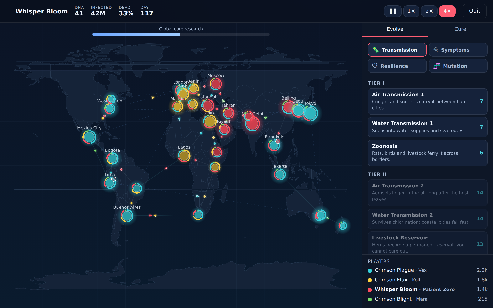

# 🦠 Contagion

A competitive, browser-based pandemic strategy game in the spirit of *Plague Inc.*
and *Pandemic* — but **multiplayer**. Engineer a disease, evolve it across a
skill tree, and race rival players to defeat the world. If your plague is
eradicated, you switch sides and join humanity's cure effort to hunt down the
remaining plagues. **The last plague standing wins.**

Plays out on a world map of major capital cities connected by land, sea, and
air routes — control and spread between them, a bit like Risk.



## Play

```bash
npm install
npm run dev        # http://localhost:5173  — play vs AI immediately
```

- **Pick a username**, choose how many AI rivals, and hit **Play vs AI**.
- **Name your disease** and choose a starting strain (Bacteria, Virus, Parasite,
  Prion, Nanovirus, Bioweapon) — each plays differently.
- **Spread & evolve:** earn DNA as you infect and kill, then spend it in a deep
  **53-node, four-branch skill tree** — **Transmission**, **Symptoms**,
  **Resilience**, **Mutation**. You can't afford it all, and several capstones
  are *mutually exclusive*, so every match you commit to a different path to
  victory (airborne blitz, silent killer, cure-proof endurer, economy engine…).
- **Watch it spread:** a real world map with country outlines, each player's
  disease colour-coded, and planes/ships/road traffic carrying the infection
  between capitals in real time.
- **Mind the cure:** the more visible and deadly you are, the faster the world
  researches a cure. Stay stealthy or out-pace them.
- **Lose and fight on:** if your plague is wiped out you join the **Cure**
  faction — spend research points to fund the cure, lock down cities, and
  vaccinate populations against the surviving plagues.

## How a match is won

- **Defeat the world** — wipe out (almost) all of humanity, or
- **Be the last plague standing** — outlast every rival disease.

Your score reflects how many people you infected and killed and how many
cities you dominated. The winner is crowned, and the full leaderboard is shown.

## Game modes

| Mode | Status | Needs a server? |
| --- | --- | --- |
| **Practice / vs AI** | ✅ Fully playable & tested | No — runs entirely in the browser |
| **Online multiplayer** | 🧪 Beta | Yes — the `/api/room` function (Vercel) |

### Online (beta)

Online play uses a **host-authoritative relay**: one player's browser runs the
authoritative simulation and posts compact state snapshots to a tiny serverless
"mailbox" (`api/room.js`); everyone posts their commands to the same endpoint.
This sidesteps real-time socket servers, which Vercel's serverless model does
not provide. Create a match to get a room code, share it, and play.

> The relay stores rooms in process memory, which is ideal for `vercel dev` and
> small single-instance deployments. For multi-instance production scale, point
> the `store` in `api/room.js` at Vercel KV / Upstash Redis (same get/set
> shape — no handler changes needed).

## Deploy to Vercel

This repo is Vercel-ready (`vercel.json`): a Vite static build plus the
`api/room.js` function.

```bash
npm i -g vercel
vercel        # preview
vercel --prod # production
```

## Architecture

```
src/
  engine/      Deterministic simulation (pure, seeded, lockstep-friendly)
    rng.js         Seedable PRNG (mulberry32)
    state.js       World graph + initial state
    sim.js         The per-tick step + command application
    scoring.js     Scores and win/loss detection
    ai.js          Disease & cure-faction bot policies
    constants.js   All balance knobs in one place
  data/        Content: cities, disease types, skill tree
  net/         transport.js (local) + online.js (host-authoritative relay)
  game/        runner.js — drives the clock, AI, commands, events
  ui/          map.js (canvas world map) + main.js (screens & HUD)
api/           room.js — serverless relay for online play
test/          Vitest unit tests + Playwright E2E + balance harness
```

The simulation is **deterministic**: same seed + same ordered commands ⇒
identical result on every machine. That keeps the door open for true lockstep
netcode, and makes the engine easy to test.

## Tests

```bash
npm test                 # 17 engine unit tests (determinism, rules, lifecycle)
node test/harness.js     # headless balance harness (prints match summaries)
node test/e2e.mjs        # Playwright browser smoke test (needs a preview server)
```

## License

MIT
